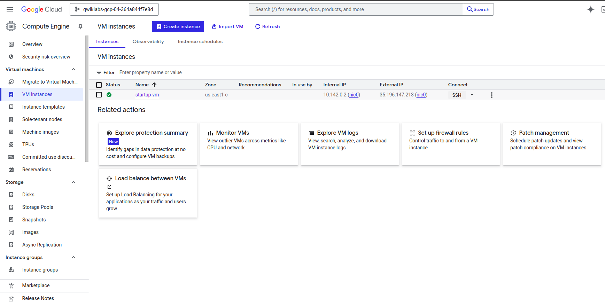
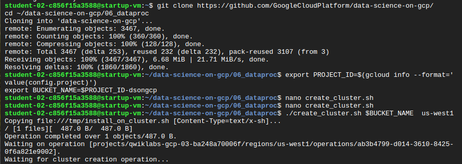
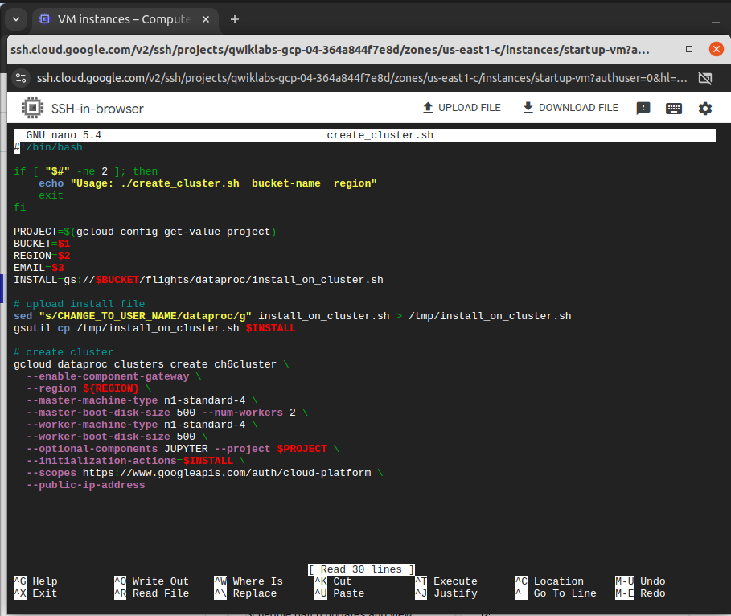
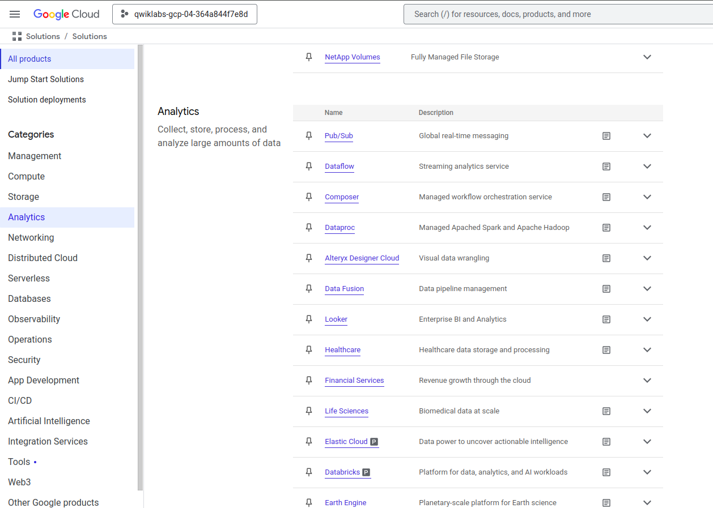
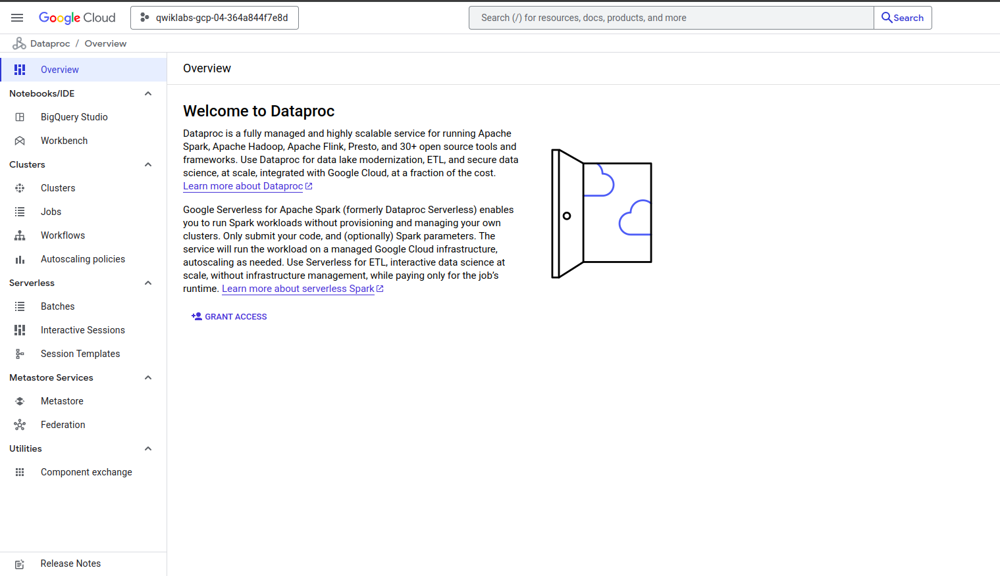
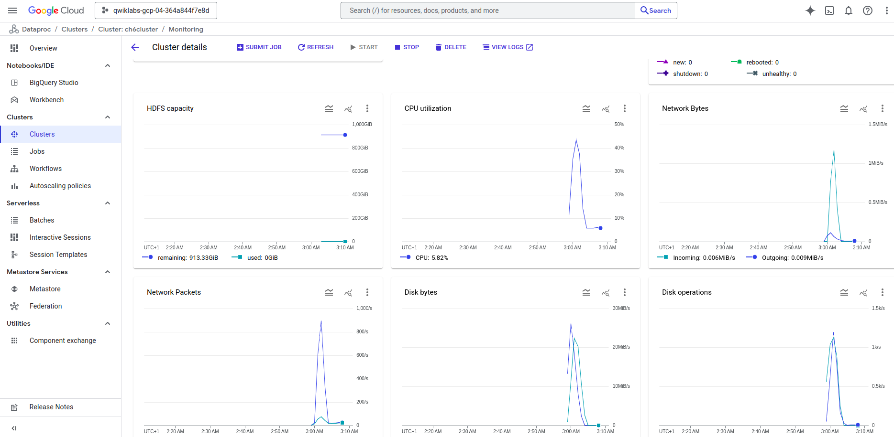
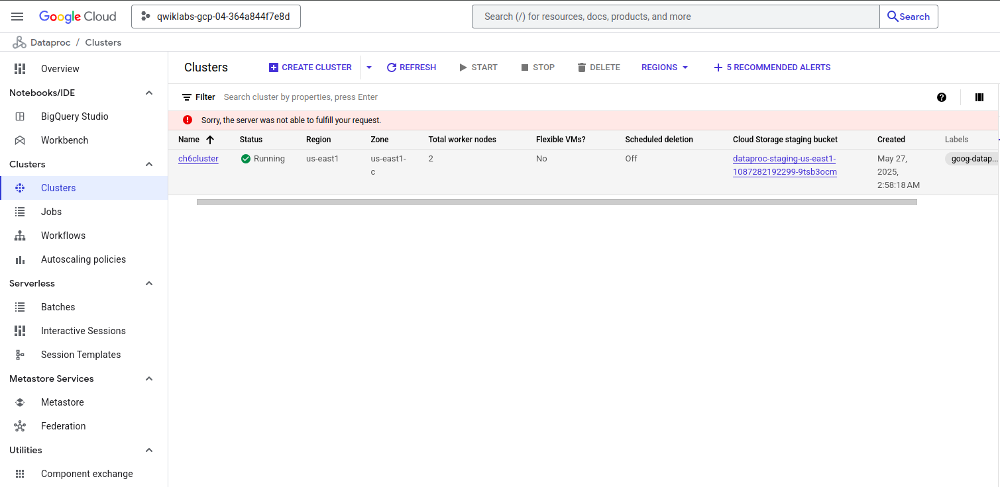
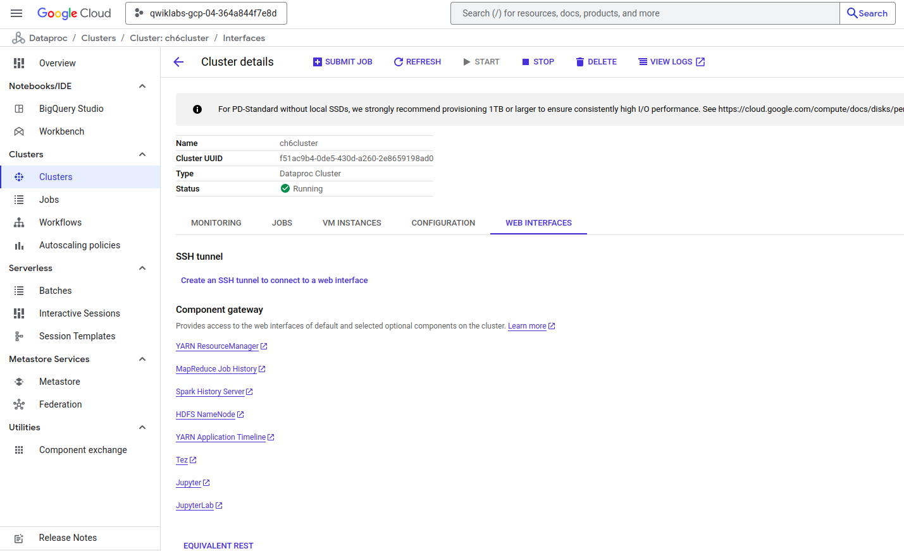

# ✈️ Machine Learning with Spark on Google Cloud Dataproc

This project demonstrates how to use **Apache Spark** on **Google Cloud Dataproc** to build a scalable **machine learning** pipeline. We use **flight delay data** to train and evaluate a **logistic regression** model for **predicting flight delays.**

## 🚀 Project Overview

- 🔍 **Goal**: Predict whether a flight will be delayed based on historical data.
- 🧠 **ML Model**: Logistic Regression (using Spark MLlib)
- ☁️ **Platform**: Google Cloud Platform (GCP)
- 🔧 **Tools Used**:
  - Google Cloud Dataproc (for Spark cluster)
  - Google Cloud Storage (for data handling)
  - Apache Spark (MLlib)
  - JupyterLab (on Dataproc for interactive development)

## 📂 Dataset 
The base dataset this lab uses is retrieved from the [US Bureau of Transportation Statistics](https://www.bts.gov/). The dataset provides historical information about internal flights in the United States and can be used to demonstrate a wide range of data science concepts and techniques. This lab provides the data as a set of CSV formatted text files.

## 🚀 Steps

Setup and requirements
 1. Create a Dataproc cluster
 2. Set up bucket and start pyspark session
 3. Read and clean up dataset
 4. Develop a logistic regression model
 5. Save and restore a logistic regression model
 6. Predict with the logistic regression model
 7. Examine model behavior
 8. Evaluate the model

---
## Screenshots :

Computer Engine > VM instances

---
ssh connection

---
Create the cluster

 ---
googleCloud > allProducts > analyticsProducts > dataproc
 

---

---

Check and open the cluster created

---

---
Open JupyterLab

